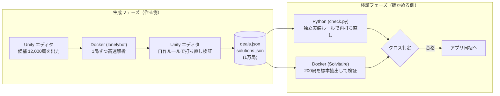

個人でスマホ向けゲーム『ソリティア世界旅行』を開発しています。

標準的なクロンダイク（ソリティア）をランダムに配牌した場合、**約9.5%の配牌はどう打っても詰む（クリア不可能）**ことが知られています（※1）。

自作アプリでは元々ランダム配牌を採用していましたが、バージョン1.1より**「事前に必ず解けることが保証された1万局」**を厳選して同梱・配布する仕組みに刷新しました。

この記事では、**「1万局が本当に解けるのか」を、生成に使ったコードやルールを一切使わず、完全に独立して実装したルールエンジンと別ソルバーでクロス検証（二重チェック）した手法**について解説します。

> ※1: 山札リターン無制限・組札からの戻しあり・Draw 1・全カード位置可視の前提でクリア可能率は 90.480%。
> 参考文献: Blake & Gent "The Winnability of Klondike Solitaire and Many Other Patience Games" ([arXiv:1906.12314](https://arxiv.org/abs/1906.12314))

---

## 1. なぜ「必ず解ける配牌」にするのか

ランダム配牌から「必ず解ける配牌」へと変更した理由は、**ゲーム性を「運（ギャンブル）」から「パズル」へシフトさせるため**です。

当時の開発ログ（Claude Codeへのプロンプト）には以下のように指示していました。

> 「必ずゲームを解決できる組み合わせにしたい。現在はランダムで配っているためクリアできない場合がありますが、毎回必ずクリアできる組み合わせのみ計算し、ユーザーに提供したい」
> 
> 「意図としては、パズル要素（必ず解答が存在し、試行錯誤してクリアを目指せる）を持たせるためです」

本作はソリティアをクリアしてコインを貯め、次の街へ移動するゲーム構造です。「どうあがいても詰む配牌」に当たってしまう体験はプレイヤーにとって純粋なストレスになるため、配牌の質を担保する必要がありました。

---

## 2. 実装アプローチの選定

「必ず解ける配牌」を提供する手法として、以下の3つを検討しました。

1. **アプリ（端末）側でランダム生成し、その場でソルバーを実行する**
   * ✕ 端末用の軽量ソルバー自作が必要。極稀に判定でUIがフリーズするリスクがある。
2. **完成状態から逆算して崩していく**
   * ✕ 実装例が乏しく、配牌の偏りが読めない。結局最後にソルバー検証が必要になる。
3. **PC（ビルド環境）側で大量に解いておき、解けた配牌のみをアプリに同梱する**
   * **◯ 採用**。端末側に計算負荷がかからず、配牌の偏りも事前に制御できる。

今回は 3 のアプローチを採用しました。ソルバーには高速な Rust 製オープンソースソルバー [lonelybot](https://github.com/vuonghy2442/lonelybot) (MITライセンス) を利用しています。

---

## 3. 生成と検証の全体フロー

1万局の配牌データを構築し、検証をパスしてアプリに組み込むまでの全体フローは以下の通りです。



### 生成フェーズの手順

1. **候補出力**: 固定シード（20260928）から 12,000 局の候補を書き出す。
2. **ソルバー実行**: Docker 内の lonelybot で 1 局あたり上限 10 秒で解析（`tools/deal-pool/solve.py`）。
3. **ゲームルールでの打ち直し**: ソルバーが出力した手数表記（Move列）を、Unity 内の `KlondikeRules` で1手ずつ忠実に再現。クリアまで合法であることを確認できた局のみを正式採用する。

実測（12,000局）では、解けた局が **10,898局（90.8%）** であり、論文の期待値（90.48%）と非常に近い結果になりました。この中から先頭 10,000 局（平均 219.29 手）を採用しています。

---

## 4. 「作ったコードで確かめない」独立検証の設計

上記の「打ち直し」だけでは重大な欠点があります。ゲーム本編で使っている `KlondikeRules` 自体にバグやルールの解釈違いがあった場合、生成・打ち直し・実機プレイのすべてが同じバグを通過してしまう点です。

そこで、検証コード（`tools/deal-verify/`）を作成するにあたり、「生成側のコード（Unity / lonelybot / 生成スクリプト）は一切読まない・使わない」という鉄則を設けました。

### 1. Pythonによる独立したルールエンジンの実装

ゲーム本体の C# コード（`KlondikeRules.cs` 等）の仕様書のみを参照し、Python の標準ライブラリだけでクロンダイクの盤面ロジック（`klondike.py`）をゼロから完全再実装しました。

```python
class Board:
    def __init__(self, order):
        # カード配置初期化ロジック
        self.tab = []
        self.down = []  # 各列の裏向きカード数
        k = 0
        for col in range(7):
            self.tab.append(list(order[k:k + col + 1]))
            self.down.append(col)
            k += col + 1
        self.stock = list(order[k:])
        self.waste = []
        self.found = [[] for _ in range(4)]

    def can_tab(self, c, t):
        # 場札への移動可否判定（色違い・1小さい数字）
        col = self.tab[t]
        if not col:
            return rank(c) == 13 # 空き列にはキングのみ
        top = col[-1]
        return red(top) != red(c) and rank(c) == rank(top) - 1
```

### 2. 全 10,000 局のシミュレーション（check.py）

`check.py` を実行し、同梱予定の `solutions.json` に記録された解法手順を Python 版ルール上で全件トレースします。1手でも非合法な手があれば即座に不合格となります。

実行結果（28.5秒）：

```text
$ python3 tools/deal-verify/check.py --out <path>
integrity:    pass
existing:     pass
ruleSources:  pass
replay:       pass (10000 deals, 0 failures)
selfTest:     pass
```

1万局すべてにおいて、独立実装された Python ロジック上でも正常にクリアできることが実証されました。

---

## 5. 検証機構自体の信頼性を担保する仕組み

「検証ツール自体がガバガバで、何でも合格にしてしまっている」可能性を排除するため、以下のメタ検証（自己テスト）を導入しています。

### 1. わざとルールや解答を破壊する（ミューテーションテスト）

検証時にあえて不正なルールや不正な解答を流し込み、「正しく不合格（エラー）を出せるか」を自動テストしています。

| 意図的に破壊した内容 | 通った局数 | 判定 |
|---|---|---|
| 配牌順を「列ごと」から「横一段ずつ」に変更 | 0局 | 成功（即不合格） |
| 山札の29枚目の位置をずらす | 0局 | 成功（即不合格） |
| 解答の最後の1手を削る | 0局 | 成功（即不合格） |
| 1手を無作為な別の手に置換 | 0局 | 成功（即不合格） |

「組み札から場札へ戻せない」といった軽微な制約変更では一部通過する局もありますが、これは「その手を使わずにクリアできた配牌」が存在することを意味しており、検証エンジンの挙動として正しいことが確認できます。

### 2. ソースコードの変更検知（SHA-256）

ゲーム本体のルールロジック（`KlondikeRules.cs` 等 5ファイル）の SHA-256 ハッシュ値を記録しておき、検証実行時に照合します。本体コードに1行でも変更が入った場合は検証がストップし、人間が Python 側のルールロジック（`klondike.py`）へ変更を同期させる運用にしています。

---

## 6. 第三の視点：別ソルバー（Solvitaire）によるダブルチェック

Python による独立検証に加え、ルールの解釈を完全に遮断した第三者ツールとして C++ 製ソルバー [Solvitaire](https://github.com/thecharlieblake/Solvitaire) を利用しました。

1万局の中からランダムに 200 局を抽出し、Docker 経由で Solvitaire に解かせてダブルチェックを行います。

- **設定の健全性チェック**: 「解けない」ことが確定しているダミー配牌 5 局を事前に解かせ、正しく「Impossible」が返るかを確認（誤設定防止）。
- **抽出検証**: 抽出した 200 局に対して試行。結果、「解けない（Impossible）」と判定された局は 0 件（197局クリア、3局はタイムアウト未判定）。

これにより、生成コード・Python検証コードの双方から独立した形で、配牌の正当性を担保できました。

---

## 7. ユーザー体験を高める配信ロジック

配牌データ（1万局）をただランダムに配ると、誕生日問題と同様に **1,000局プレイした段階で約50回も同じ配牌が重複** してしまいます。

そこで、配牌総数 $N$ と互いに素な「歩幅（step）」を算出する擬似乱数ロジックを組み込みました。

$$
\text{dealId} = (\text{start} + k \times \text{step}) \pmod N
$$

この数式を用いることで、$N$ 局遊ぶまで一度も同じ配牌が出ず、メモリ消費も最小限（パラメータ整数4つのみ保存）に抑えることができます。

また、同梱した `solutions.json` を使って「解答を見る」オートプレイ機能も実装しました。


*▲ 解答の自動再生画面。一時停止や1手進む/戻す操作が可能*

---

## 8. AI（Claude Code）とのマルチエージェント的役割分担

本プロジェクトのコード実装は主に Claude Code を活用しています。その際、プロンプトの出し方と設計方針で最も重視したのは「コンテキストの分離」です。

- **生成エージェント（`generate-solvable-deals`）**
  - 配牌の生成、lonelybot の呼び出し、Unityコードへの変換を担当。
- **検証エージェント（`verify-solvable-deals`）**
  - 生成側のコードや会話履歴を一切渡さず、独立したタスクとして呼び出す。

生成の経緯（変換の癖など）を検証側に渡してしまうと、AIも同じ思い込み・前提条件を引き継いでバグを見逃してしまいます。「人間が設計責任を持ち、AIを2つの独立した役割に分けてクロスチェックさせる」という構成が、信頼性の高いアルゴリズム構築に役立ちました。

---

## おわりに

配牌をただ「解けるものにする」だけでなく、「生成ロジックと検証ロジックを分離し、自動化されたテスト機構で守る」ことによって、安心して遊べるパズル型ソリティアを構築できました。

この仕組みを導入した『ソリティア世界旅行』ver 1.1 は各ストアで配信中です。ぜひ実際に触ってみてください。

- [App Store](https://apps.apple.com/app/apple-store/id6792692437?pt=118937052&ct=zenn-deals&mt=8)
- [Google Play](https://play.google.com/store/apps/details?id=com.one_wheat.solitaire_world&hl=ja&referrer=utm_source%3Dzenn%26utm_medium%3Dreferral%26utm_campaign%3Dzenn-deals)
- [公式サイト](https://one-wheat.com/solitaire-world-tour/?utm_source=zenn&utm_medium=referral&utm_campaign=zenn-deals)
- [公式サイトの読み物](https://one-wheat.com/solitaire-world-tour/solvable.html)

## 関連する記事

- (公開後に進行役が足す)
